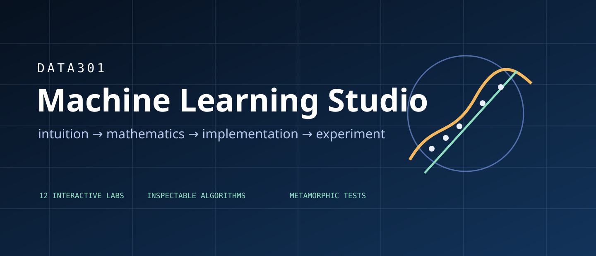

<p align="center">
  
</p>


# DATA301 Machine Learning Studio

**An interactive, production-grade learning environment for DATA301 — Machine Learning at Vidyashilp University.**

[Live course platform](https://data301-ml-studio.vercel.app) · [Interactive Labs](https://data301-ml-studio.vercel.app/labs) · [Course Overview](https://data301-ml-studio.vercel.app/course)

DATA301 ML Studio turns a conventional course website into a connected learning system. Students can move from course context to concept intuition, mathematics, interactive model behaviour, practical implementation, evaluation, projects, and instructor-managed resources without losing the thread of the curriculum.

## What makes it different

- **Course Overview first** — students understand DATA301, its outcomes, workload, prerequisites, and four-module journey before entering individual algorithms.
- **Twelve interactive laboratories** — browser-based experiments expose cause and effect across regression, classification, clustering, optimization, dimensionality reduction, evaluation, generalization, and ensembles.
- **Module 2 as a connected experience** — the 110-slide supervised-learning presentation is mapped to lessons and labs spanning regression, gradient descent, metrics, classification, KNN, trees, SVM, ensembles, and bias–variance reasoning.
- **Instructor-managed content** — authenticated staff can upload, draft, schedule, publish, archive, and version course resources without rebuilding the frontend.
- **Private academic storage** — Supabase Storage remains private; released files are delivered through short-lived signed URLs.
- **A real course-to-code bridge** — the interactive Labs link to the instructor’s separate [ML Lab repository](https://github.com/shabbeersh/ML_lab) for Python/Jupyter practice. The interactive platform source remains in this repository.
- **Institutional identity without generic template design** — VU campus imagery, academic context, and a distinctive data/geometry visual system coexist with a responsive technical interface.

## Interactive laboratories

| Family | Laboratories |
|---|---|
| Regression & optimization | Linear Regression, Gradient Descent, Overfitting & Generalization |
| Classification | Logistic Regression, KNN, Decision Tree, Support Vector Machine |
| Unsupervised learning | K-Means, PCA |
| Evaluation & ensembles | Confusion Matrix, ROC & Precision–Recall, Ensemble Learning |

Every released Lab includes a learning objective, bounded controls, deterministic or reproducible data where appropriate, immediate visual feedback, a reset path, metric/interpretation panels, numerical safeguards, keyboard-accessible controls, and responsive behaviour.

## Course architecture

```text
Course Overview
    ↓
Module 1 — Foundations & Data
    ↓
Module 2 — Supervised Learning
    ↓
Module 3 — Unsupervised Learning
    ↓
Module 4 — Model Building & Perceptron
    ↓
Projects, evaluation, and independent judgement
```

The platform models the official 15-week progression with 30 lecture sessions and 30 paired practice sessions.

## Module 2 integration

Module 2 is not presented as a detached PDF. The platform maps the supplied presentation into four connected pathways:

1. **Supervised learning** — labelled examples, features, targets, regression, and classification.
2. **Regression** — linear and multiple regression, cost functions, gradient descent, MAE, MSE, RMSE, and R².
3. **Classification** — logistic regression, KNN, decision trees, class imbalance, SVM, and ensembles.
4. **Generalization** — model complexity, underfitting, overfitting, bias, and variance.

See [`docs/MODULE_2_CONTENT_MAP.md`](docs/MODULE_2_CONTENT_MAP.md) for the evidence-based topic and Lab mapping.

## Technology

- **Frontend:** Next.js, React, TypeScript, CSS
- **Learning visualizations:** custom SVG/DOM interactions and deterministic TypeScript algorithms
- **Mathematics:** KaTeX
- **Backend:** Supabase Auth, PostgreSQL, Row Level Security, private Storage
- **Validation:** Node test runner, TypeScript, source-integrity checks, production smoke tests
- **Deployment:** Vercel

## Architecture

```text
GitHub — canonical software source
        │
        ▼
Vercel — public course application
        │
        ├── Student experience
        ├── 12 interactive Labs
        ├── Search, topics, projects, resources
        └── Protected instructor portal
                 │
                 ▼
Supabase — authentication, relational content, private files

External course implementation path:
Interactive Lab → Instructor ML_lab repository
```

## Privacy and ownership boundaries

This repository contains the **platform software**, interactive Labs, product architecture, tests, database migrations, and documentation. It intentionally does **not** contain:

- Supabase/Vercel/GitHub secrets or local environment files;
- instructor passwords or recovery tokens;
- the detailed private Course Plan;
- Module 1/Module 2 presentation binaries or other private course files.

Those academic binaries are uploaded separately to private Supabase Storage during an authorized release. Vidyashilp University marks, campus imagery, and instructor-authored course content are not relicensed by this repository. See [`NOTICE.md`](NOTICE.md) and [`docs/ATTRIBUTION_AND_OWNERSHIP.md`](docs/ATTRIBUTION_AND_OWNERSHIP.md).

## Local development

Requirements: Node.js 22.16 or newer.

```bash
npm install
cp .env.example .env.local
npm run dev -- -p 3001
```

Open `http://localhost:3001`.

## Environment

```env
NEXT_PUBLIC_SUPABASE_URL=https://YOUR_PROJECT.supabase.co
NEXT_PUBLIC_SUPABASE_PUBLISHABLE_KEY=sb_publishable_...
NEXT_PUBLIC_SITE_URL=http://localhost:3001
SUPABASE_SECRET_KEY=sb_secret_...
```

`SUPABASE_SECRET_KEY` is server-only. Never expose it in browser code or commit `.env.local`.

## Quality gate

```bash
npm run verify:release
```

The gate runs:

1. source/package integrity and secret scanning;
2. algorithm, content, privacy, and security tests;
3. TypeScript checking;
4. an optimized Next.js production build.

After deployment:

```bash
npm run smoke:cosmic -- https://data301-ml-studio.vercel.app
```

The live test verifies public routes, all twelve Labs, Module 2 topics, search, VU assets, production metadata, signed Module 2 delivery, Course Overview ordering, developer attribution, the external instructor-repository bridge, and public blocking of the staff-only Course Plan.

## Release workflow

The complete account-authorized release is automated by the separately supplied `COSMIC_RELEASE.command`. It clones this canonical repository, creates a rollback checkpoint, overlays the verified V4 source, applies the Supabase migration, provisions the instructor account, uploads private academic files, runs the full quality gate, pushes a release branch, deploys to Vercel, smoke-tests production, and only then promotes the verified commit to `main` and tags `v4.0.0`.

No destructive force-push is used. A failed check stops the release before promotion.

## Attribution

- **Course instruction and academic materials:** Dr. Shabbeer Basha, Vidyashilp University
- **Platform design and development:** Krishna V Gowda, Academic Assistant — DATA301
- **Instructor practical repository:** [`shabbeersh/ML_lab`](https://github.com/shabbeersh/ML_lab)

The production interface keeps course and university identity primary while retaining a discreet, discoverable platform-development credit.
